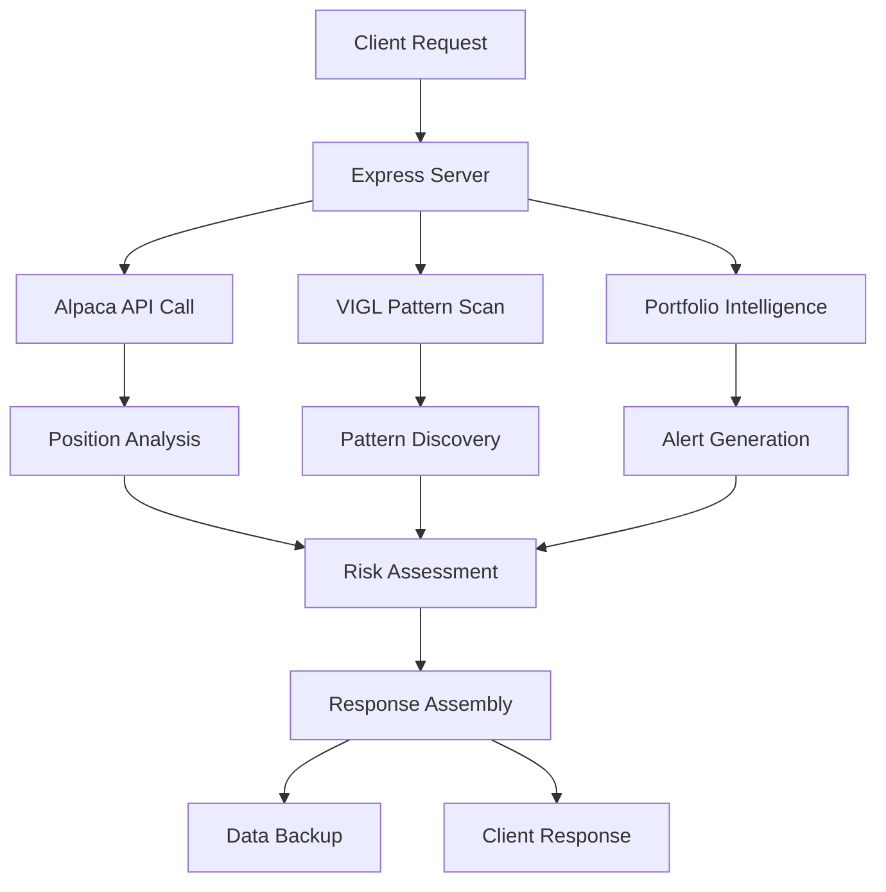

# Trading Intelligence Dashboard - API Documentation

## 🌐 **API Overview**

The Trading Intelligence Dashboard provides a RESTful API for accessing real-time portfolio data, VIGL pattern discoveries, and intelligent alerts.

**Base URL**: `https://trading-dashboard-dvou.onrender.com`  
**Local Dev**: `http://localhost:3001`

---

## 📊 **Core Endpoints**

### **Dashboard Data**
```http
GET /api/dashboard
```

**Description**: Primary endpoint that returns complete dashboard data including portfolio positions, VIGL discoveries, and intelligent alerts.

**Response Format**:
```json
{
  "portfolio": {
    "positions": [
      {
        "symbol": "AAPL",
        "quantity": "50",
        "current_price": "175.50",
        "market_value": "8775.00",
        "unrealized_pl": "425.50",
        "unrealized_plpc": "0.0508",
        "riskAnalysis": {
          "wolfScore": 0.25,
          "riskLevel": "LOW",
          "recommendation": "BUY_MORE"
        }
      }
    ],
    "totalValue": 125482.31,
    "dailyPnL": 0.00,
    "buyingPower": 197737.42
  },
  "discoveries": [
    {
      "symbol": "GV",
      "confidence": 0.92,
      "volumeSpike": 11.4,
      "momentum": 66.4,
      "estimatedUpside": "200-400%",
      "recommendation": "STRONG BUY",
      "timestamp": "2025-08-07T12:34:56Z"
    }
  ],
  "alerts": [
    {
      "id": "portfolio-summary",
      "type": "PORTFOLIO",
      "severity": "MEDIUM",
      "title": "💰 Portfolio: $125,482",
      "message": "📈 Day P&L: $+0 | 5 positions",
      "timestamp": "2025-08-07T12:34:56Z"
    }
  ],
  "lastUpdated": "2025-08-07T12:34:56Z",
  "summary": {
    "totalValue": 125482.31,
    "dailyPnL": 0.00,
    "viglScore": 0.92,
    "avgWolfRisk": 0.35,
    "highRiskPositions": 0,
    "viglOpportunities": 3
  }
}
```

**Status Codes**:
- `200`: Success
- `500`: Server error (API connection issues)

**Caching**: Response is cached for 30 minutes to prevent excessive API calls

---

### **Health Check**
```http
GET /health
```

**Description**: System health status endpoint for monitoring and uptime checks.

**Response Format**:
```json
{
  "status": "healthy",
  "timestamp": "2025-08-07T12:34:56Z",
  "uptime": 3600,
  "memory": {
    "used": "45.2 MB",
    "free": "128.8 MB"
  }
}
```

**Status Codes**:
- `200`: System healthy
- `503`: System unhealthy

---

## 🎯 **Data Models**

### **Position Object**
```typescript
interface Position {
  symbol: string;           // Stock symbol (e.g., "AAPL")
  quantity: string;         // Number of shares held
  current_price: string;    // Current market price
  market_value: string;     // Total position value
  unrealized_pl: string;    // Unrealized profit/loss ($)
  unrealized_plpc: string;  // Unrealized profit/loss (%)
  riskAnalysis: {
    wolfScore: number;      // Risk score (0-1, higher = riskier)
    riskLevel: string;      // "LOW" | "MEDIUM" | "HIGH"
    recommendation: string; // "BUY_MORE" | "HOLD" | "SELL"
  }
}
```

### **Discovery Object**
```typescript
interface Discovery {
  symbol: string;           // Stock symbol
  confidence: number;       // Pattern similarity (0-1)
  volumeSpike: number;      // Volume multiplier vs average
  momentum: number;         // Momentum percentage
  estimatedUpside: string;  // Expected return range
  recommendation: string;   // "STRONG BUY" | "BUY" | "WATCH"
  timestamp: string;        // ISO date string
}
```

### **Alert Object**
```typescript
interface Alert {
  id: string;              // Unique alert identifier
  type: string;            // "PORTFOLIO" | "RISK" | "OPPORTUNITY" | "STRATEGY"
  severity: string;        // "HIGH" | "MEDIUM" | "LOW"
  title: string;           // Alert title with emoji
  message: string;         // Detailed alert message
  timestamp: string;       // ISO date string
  symbol?: string;         // Related stock symbol (optional)
}
```

---

## 🔄 **Real-time Updates**

### **Automatic Refresh**
- Dashboard data refreshes automatically every 30 minutes
- VIGL discoveries are cached to prevent excessive scanning
- Portfolio positions update on each API call
- Alerts are regenerated with fresh data

### **Manual Refresh**
To force a fresh data fetch (bypassing cache):
- Reload the dashboard page
- API calls automatically trigger fresh data collection

---

## 🛡️ **Authentication & Security**

### **API Keys**
The system uses server-side API key management:
- **Alpaca API**: For portfolio and position data
- **Polygon API**: For market data and VIGL scanning
- No client-side API keys required

### **CORS Policy**
- Development: Allows all origins
- Production: Restricted to dashboard domain

### **Rate Limiting**
- Portfolio data: No artificial limits (Alpaca handles rate limiting)
- VIGL scanning: Limited by 30-minute intelligent caching
- Health checks: No limits

---

## 📊 **Error Handling**

### **Common Error Responses**
```json
{
  "error": "Failed to fetch dashboard data",
  "details": "Alpaca API connection timeout",
  "timestamp": "2025-08-07T12:34:56Z",
  "retryAfter": 300
}
```

### **Error Codes**
- `400`: Bad Request (malformed request)
- `403`: Forbidden (API key issues)
- `429`: Too Many Requests (rate limited)
- `500`: Internal Server Error (system issues)
- `503`: Service Unavailable (external API down)

### **Graceful Degradation**
- If Alpaca API fails: Shows cached portfolio data with warning
- If VIGL scan fails: Shows previous discoveries with timestamp
- If alerts fail: Falls back to basic system status

---

## 🧪 **Development & Testing**

### **Local Testing**
```bash
# Start local server
npm start

# Test endpoints
curl http://localhost:3001/health
curl http://localhost:3001/api/dashboard
```

### **Production Testing**
```bash
# Health check
curl https://trading-dashboard-dvou.onrender.com/health

# Dashboard data
curl https://trading-dashboard-dvou.onrender.com/api/dashboard
```

### **Response Time Monitoring**
- Target: <2 seconds for dashboard endpoint
- Health check: <100ms
- Monitoring via Render deployment logs

---

## 🔍 **Data Flow**

### **Dashboard Endpoint Data Flow**


### **Caching Strategy**
- **VIGL Discoveries**: 30-minute cache (file-based)
- **Portfolio Data**: Real-time (no cache)
- **Alerts**: Generated fresh on each request
- **Static Assets**: Browser cache (1 hour)

---

## 📈 **Performance Metrics**

### **Endpoint Performance Targets**
| Endpoint | Target Response Time | Availability |
|----------|---------------------|--------------|
| `/health` | <100ms | 99.9% |
| `/api/dashboard` | <2000ms | 99.5% |
| Static files | <500ms | 99.9% |

### **Monitoring**
- Render provides automatic uptime monitoring
- Response times logged in application logs
- Error rates tracked via exception logging

---

## 🚀 **Future API Enhancements**

### **Planned Endpoints** (Phase 3)
```http
GET /api/historical/{symbol}     # Historical performance data
GET /api/predictions/{symbol}    # AI-generated predictions
POST /api/trades                 # Trade execution endpoint
GET /api/analytics/patterns      # Pattern success analytics
```

### **WebSocket Support** (Phase 4)
- Real-time portfolio updates
- Live VIGL discovery notifications
- Instant alert delivery

---

**Last Updated**: August 7, 2025  
**API Version**: 1.0  
**System Status**: 🟢 Production Ready